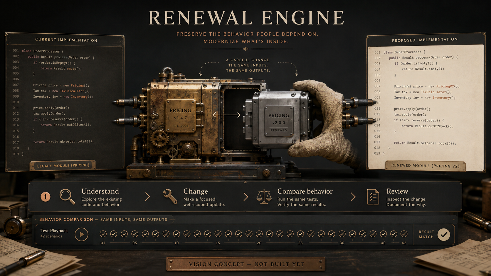

# Renewal Engine

**Help entire software ecosystems modernize without losing the behavior people rely on.**

The hardest software to replace is the software that already does thousands of invisible things correctly.

> This is a public planning repository. There is no product implementation or playable build yet. The image is an AI-generated vision reference, not a screenshot. All waves and tasks are proposed; no completed work, community approval or funding is implied.

## The mission

Build an open modernization system that helps teams understand existing behavior, propose narrow changes and compare the results. Combine deterministic transformations, AI-assisted patches and reproducible evidence so useful old software can keep evolving.

Choose a migration, map the affected behavior, capture representative fixtures, propose a transformation, run old and new versions against the same cases, inspect the differences and adopt changes through normal review.

## Who this is for

Maintainers and engineering teams with aging libraries, frameworks and business-critical applications.

## The first thing we want to prove

One well-scoped library or framework upgrade in an approved open-source fixture, with a deliberately wrong transformation that the behavior comparison must catch.

A green test suite may miss the behavior that matters. Document coverage gaps and observed contracts; use deliberate wrong changes to test the checks. Never claim general semantic equivalence for arbitrary programs.

## What this could become

A shared library of migration recipes, behavior fixtures and compatibility knowledge across languages and ecosystems, usable locally on private code as well as public projects.

Automated refactoring already has mature foundations. The proposed contribution joins source understanding, differential behavior checks, migration planning and reviewable AI patches into a maintainable end-to-end workflow.

## Why build it together

Maintainers can contribute one migration recipe, one tricky fixture or one language adapter. Thousands of small, well-tested contributions can reduce repeated migration work across an ecosystem.

We are looking for founding maintainers and contributors who can make one small, reviewable part real. Bring a concrete use case, a difficult test case, an interface sketch or a focused patch. If you use a coding agent, give it one agreed task and review its result. Accepted work matters more than generated volume.

## How to join

Start with [the project on Tanduna](https://tanduna.com/projects/renewal-engine). Read the [six-wave roadmap](ROADMAP.md) and [twelve proposed tasks](TASKS.md), then join the planning discussion and say which result you can help deliver. Propose scope before starting overlapping implementation. GitHub holds the source; Tanduna is where we organize the project and its community.

- **W1: Know what must survive.** Choose one migration and define its behavior boundary.
- **W2: Understand and propose a narrow change.** Build a useful transformation pipeline.
- **W3: Compare behavior, including failures.** Make evidence stronger than a successful build.
- **W4: Recipes other maintainers can trust.** Turn the single migration into a contribution format.
- **W5: Modernize connected systems carefully.** Extend to staged, multi-repository changes.
- **W6: An ecosystem that stays maintainable.** Validate sustained use and recipe quality.

## What we are not promising

No automatic merging or production migration, private-code upload by default, universal language support or a guarantee that an upgrade has no regressions.

There is no delivery date, token target, paid offer or crowdfunding campaign here. Community interest does not guarantee a finished product. The next milestone depends on contributors, maintainer capacity and evidence from the previous one.

## Existing work we should learn from

- [OpenRewrite](https://docs.openrewrite.org/)

These are related foundations and references, not partners or endorsements. We should reuse compatible components or contribute upstream when that is the better route. This proposal does not claim that its individual ingredients are unprecedented. Dependencies and their licenses will be evaluated before adoption.

## License and contribution

This repository is published under [GNU AGPL-3.0](LICENSE). See [CONTRIBUTING.md](CONTRIBUTING.md) for the proposed contribution workflow and [the image note](assets/README.md) for concept provenance.
